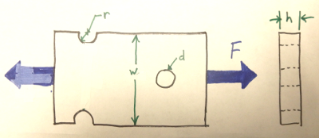

Problem 2
=========

The element shown below is subjected to a fluctuating load that ranges between
4 kip in tension and 14 kip in compression. The dimensions are :math:`r=0.313
\mathrm{in}`, :math:`d=0.5\mathrm{in}`, :math:`h=0.375\mathrm{in}`,
:math:`w=4\mathrm{in}`. Determine the factor of safety if the material is cold
drawn AISI 1018 steel.

